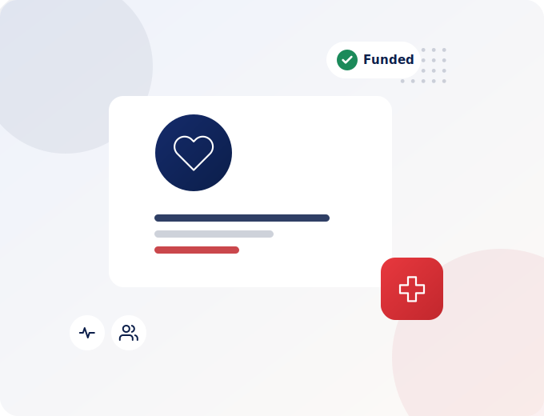

# Touch Abroad Educational Services — Website

A production-ready, multi-page static website for **Touch Abroad Educational Services**
(touchabroad.ca) — a Mississauga, Ontario consultancy that helps Ontario residents enrol
in government-funded and self-funded career-college programs.

Built as clean, semantic HTML5 + modern CSS + vanilla JavaScript. No frameworks, no build
step required to deploy. A small Python script (`build.py`) is included only so the team can
regenerate pages from shared partials after edits — **the HTML files are the deliverable and
work on their own.**

---

## 1. Folder Structure

```
touchabroad/
├── index.html                      Home
├── psw.html                        Personal Support Worker (PSW) program
├── office-administration.html      Office Administration Professional program
├── early-childhood-assistant.html  Early Childhood Assistant (ECA) program
├── cyber-security.html             Cyber Security program
├── psw-self-funded.html            PSW — Self-Funded (international students & work permit holders)
├── psw-self-funded-elementor.html  Elementor-ready, self-contained version of the Self-Funded PSW page
├── contact.html                    Contact Us (+ map, reads ?course= to preselect)
├── privacy-policy.html             Privacy Policy (PIPEDA-aligned)
├── thank-you.html                  Shared thank-you / conversion page (reads ?form=)
├── 404.html                        Not-found page
├── robots.txt                      Crawl rules + sitemap reference
├── sitemap.xml                     XML sitemap (indexable pages)
├── build.py                        Optional page generator (regenerates the HTML)
│
├── assets/
│   ├── css/
│   │   └── styles.css              Full design system + all components
│   ├── js/
│   │   ├── tracking.js             dataLayer, attribution capture, scroll/click tracking
│   │   ├── forms.js                Form validation, spam protection, lead submission
│   │   └── main.js                 Nav, mobile menu, FAQ accordion, scroll reveal, counters
│   └── images/
│       └── touchabroad-logo.png    Logo (provided)
│
└── partials/                       Source fragments used by build.py (not served)
    ├── head.tpl                    <head> template + GTM container snippet
    ├── header.html                 Promo bar, top bar, navbar, mobile menu
    ├── footer.html                 Footer + WhatsApp float
    └── scripts.html                Lead-capture config + script tags
```

> The `partials/` folder and `build.py` are **development sources**. You can upload them or
> leave them out of production — the `.html` files do not depend on them at runtime.

---

## 2. Installation / Local Preview

No dependencies are required to view the site. Either:

**Option A — open directly**
Double-click `index.html`. (Note: the `?course=` preselect and `?form=` thank-you logic use
query strings, which work best over a server — see Option B.)

**Option B — run a local server (recommended)**
```bash
cd touchabroad
python3 -m http.server 8080
# visit http://localhost:8080
```

**Regenerating pages (optional, only if you edit partials):**
```bash
cd touchabroad
python3 build.py        # rewrites index.html, psw.html, … from partials/
```

---

## 3. Deployment

The site is fully static and host-agnostic.

- **Static hosts** (Netlify, Vercel, Cloudflare Pages, GitHub Pages, S3+CloudFront):
  upload the folder contents as-is. Set `404.html` as the not-found page where supported.
- **Traditional / cPanel hosting:** upload everything to `public_html/`.
- **WordPress (current Touch Abroad stack):** see *“WordPress / Elementor / CF7 notes”* in
  `DOCUMENTATION.md` — the forms are written so the markup maps cleanly onto Contact Form 7.

After deploying, in **Google Search Console** submit `https://www.touchabroad.ca/sitemap.xml`.

### Before going live — replace these placeholders
| Placeholder | Where | Replace with |
|---|---|---|
| `GTM-XXXXXXX` | `partials/head.tpl` **and** every `.html` `<head>` + `<noscript>` | Your real GTM container ID |
| `window.TA_CONFIG.endpoint` (empty) | `partials/scripts.html` / each page | Your Apps Script / webhook URL (see DOCUMENTATION.md) |
| Social links (`#`) | `partials/footer.html` | Facebook / Instagram / YouTube / LinkedIn URLs |
| Map `src` | `contact.html` (`.map-embed iframe`) | Your Google Maps embed URL |
| Image placeholders | see manifest below | Real royalty-free / brand photos |

> If you edit `partials/`, run `python3 build.py` to propagate changes to all pages.
> If you only have the `.html` files, edit the `<head>` GTM ID and the `TA_CONFIG` block on
> each page directly (find-and-replace works well).

---

## 4. Images & Illustrations

The site now ships with a set of **custom, on-brand SVG illustrations** (in
`assets/images/`, prefixed `illus-`). They use the navy/red palette, scale crisply on any
screen, load instantly and — unlike external photos — can never appear "broken." They fill
the About sections, the program "Why Touch Abroad" visuals and the Contact hero.

These are a polished placeholder-quality visual you can ship as-is, **or** swap for real
brand photography whenever you have it. To swap one out, replace the `` `src` with your
photo and keep the `ratio-img` class (it keeps the rounded frame and crops nicely):

```html
<!-- before -->
<div class="about-img"></div>
<!-- after -->
<div class="about-img"></div>
```

### Where each illustration is used / what a real photo would show

| Slot | Current illustration | Suggested real photo | Dimensions | Suggested `alt` |
|---|---|---|---|---|
| Home → About | `illus-team.svg` | `about-team.jpg` | 520×640 | `Rahul Loomba and the Touch Abroad team in Mississauga` |
| PSW → About | `illus-psw.svg` | `psw-care.jpg` | 680×520 | `Personal Support Worker assisting a senior in long-term care` |
| PSW → Why | `illus-psw-port.svg` | `psw-team.jpg` | 520×620 | `Touch Abroad healthcare program advisor` |
| Office → About | `illus-office.svg` | `office-professional.jpg` | 680×520 | `Office administrator working at a reception desk` |
| Office → Why | `illus-office-port.svg` | `office-team.jpg` | 520×620 | `Office administration class in session` |
| ECA → About | `illus-eca.svg` | `eca-childcare.jpg` | 680×520 | `Early Childhood Assistant supporting children at a daycare` |
| ECA → Why | `illus-eca-port.svg` | `eca-team.jpg` | 520×620 | `Early childhood education classroom` |
| Cyber Security → About | `illus-cyber.svg` | `cyber-security.jpg` | 680×520 | `Cyber security analyst monitoring network activity` |
| Cyber Security → Why | `illus-cyber-port.svg` | `cyber-team.jpg` | 520×620 | `Cyber security operations centre team` |
| Contact → Hero | `illus-support.svg` | `support-team.jpg` | 680×520 | `Touch Abroad advisor ready to help by phone` |
| Logo (in use) | `touchabroad-logo.png` | — | ~180×48 | `Touch Abroad Educational Services logo` |
| Social share (meta) | — | `og-image.jpg` | 1200×630 | *(branded cover image used by OG/Twitter tags)* |

> Extra portrait/landscape variants (`illus-team-land.svg`) are included for flexibility.
> The illustrations are regenerated by `_illus.py` if you ever want to tweak them.

**Real-photo guidance:** prefer authentic, diverse Canadian photos (students, healthcare
workers, offices, childcare). Compress to WebP/optimised JPG, keep images under ~250 KB, and
keep `loading="lazy"` on below-the-fold images.

---

## 4b. Elementor-ready version (WordPress)

`psw-self-funded-elementor.html` is a **self-contained, single-file** version of the
Self-Funded PSW page, made for pasting into Elementor:

- **All CSS is scoped under a `.ta-lp` wrapper**, so it can't clash with your theme or other
  Elementor styles.
- **Illustrations are inlined as SVG** — nothing to upload to the Media Library.
- **No external stylesheet** — the whole design travels with the HTML (fonts load from Google
  Fonts via one `@import`).

**How to use it:**
1. In WordPress, create/edit the page and set the Elementor page layout to **Canvas** (or
   **Full Width**) so your theme header/footer wrap it cleanly.
2. Drop in a single **HTML widget** and paste the entire file contents.
3. Update the internal links (`psw.html`, `contact.html`, `thank-you.html`, etc.) to your
   real WordPress permalinks.
4. **Forms:** the inline JS does demo validation + redirect. For production, replace each
   `<form>` with a **Contact Form 7** or **Elementor Form** — the fields already use clean
   `name=` attributes (`full_name`, `phone`, `email`, `course`, `contact_method`, `message`,
   `consent`) so they map across directly.

`<!-- SECTION: … -->` comments mark each section if you'd rather split them across multiple
Elementor widgets/containers. Want the other pages delivered the same way, or as a native
importable Elementor template (JSON)? That can be produced too.

## 5. Forms

Six uniquely-named lead forms ship across the site (`home_hero`, `home_mid`, `home_footer`,
`psw_hero`, `psw_footer`, `office_hero`, `office_footer`, `eca_hero`, `eca_footer`,
`contact_main`). Each includes:

- Required-field validation (name, phone, email, consent) with inline errors
- Email + phone format checks
- Privacy-consent checkbox linking to the Privacy Policy
- Spam protection: hidden honeypot field **and** a submission time-trap
- Success / error messaging and a redirect to `thank-you.html?form=<name>`

By default forms succeed gracefully even with no backend configured (so you can demo
immediately). To capture leads for real, set `TA_CONFIG.endpoint` — full instructions,
plus a ready-to-paste Google Apps Script, are in **`DOCUMENTATION.md`**.

---

## 6. What’s included vs. what needs a backend

**Fully working client-side (this deliverable):** all pages, responsive layouts, forms +
validation + spam protection, GTM dataLayer events, attribution capture (UTM/GCLID/FBCLID),
thank-you conversion events, SEO meta, structured data, sitemap, robots.

**Requires a backend / third-party service (architecture is ready, see DOCUMENTATION.md):**
server-side lead storage, the admin **lead-management dashboard**, IP-address capture, and
direct CRM writes (Zoho/HubSpot/Salesforce). These can’t run from static HTML alone; the
forms are built to POST a complete, well-structured payload to whatever endpoint you choose
(Google Sheets via Apps Script, Zapier/Make webhook, or a custom API).

---

## 7. Tech notes

- Canadian English throughout (enrol, organisation, recognised…).
- Accessibility: semantic landmarks, skip link, `:focus-visible`, ARIA on accordion/menu,
  `prefers-reduced-motion` support.
- Performance: system fonts fallback, lazy-loadable images, no render-blocking libraries,
  deferred scripts.
- Browser support: all modern evergreen browsers.

For analytics, tracking, conversion and integration details, see **`DOCUMENTATION.md`**.
